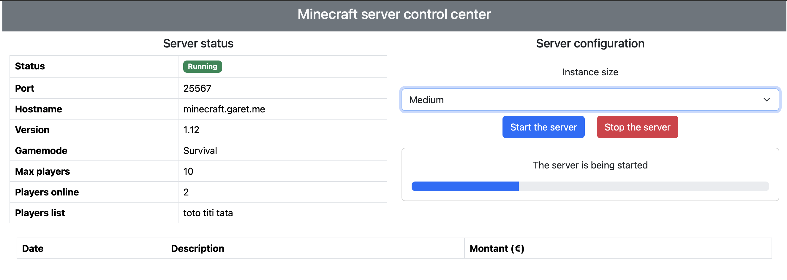

# minecraft-server
> [!WARNING]
> This project is still in development

This project's aim is to be able to start & stop a Minecraft server hosted on OVH public cloud solution using a web interface. At shutdown the server is destroyed, only data is kept on a volume to keep pricing as low as possible.
The project is divided into 2 parts

## Terraform
To automatically deploy & destroy the Minecraft server

## HTTP server
To monitor and operate the server

## Pictures
